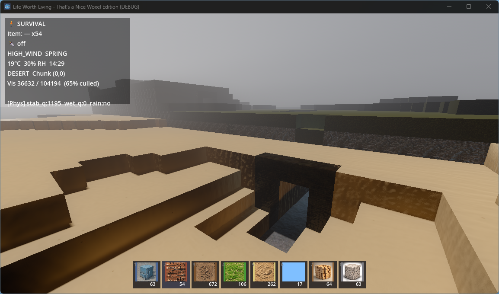
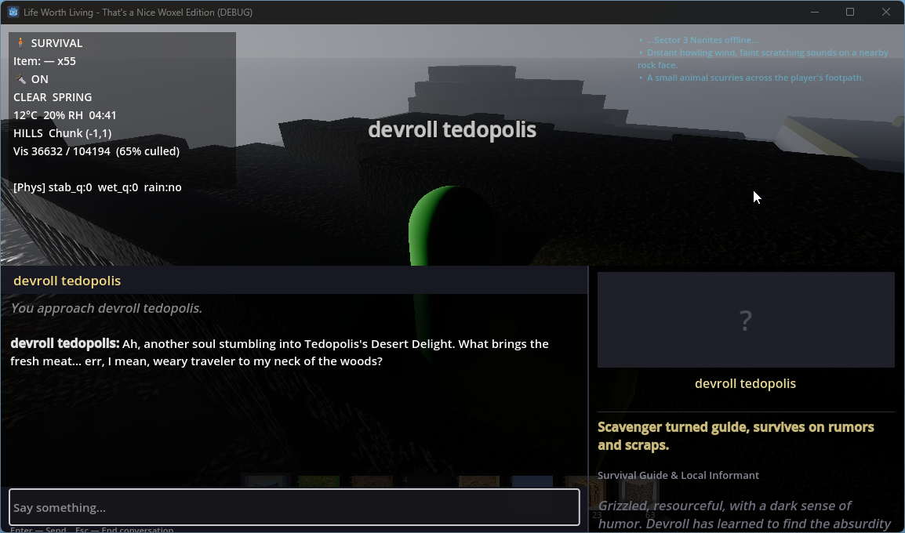
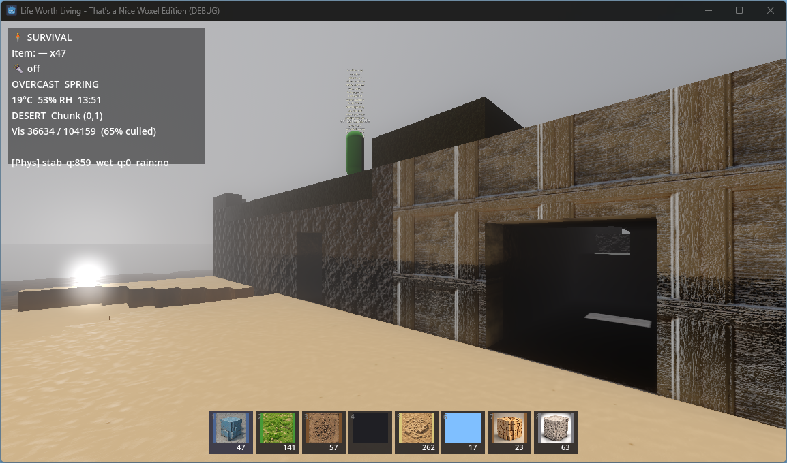
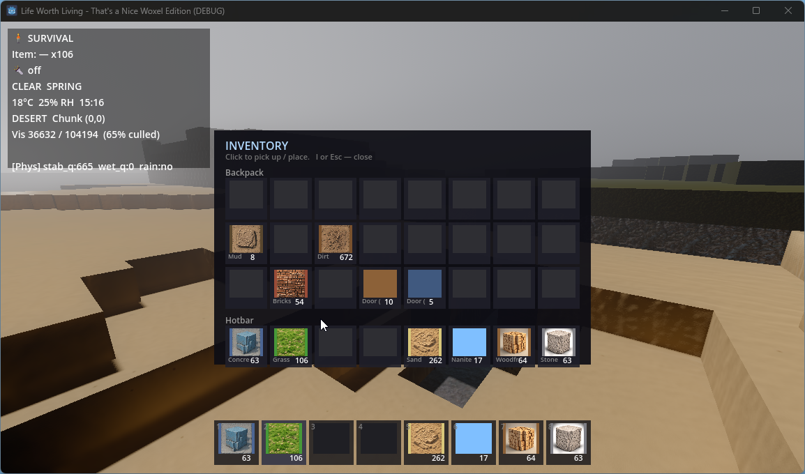
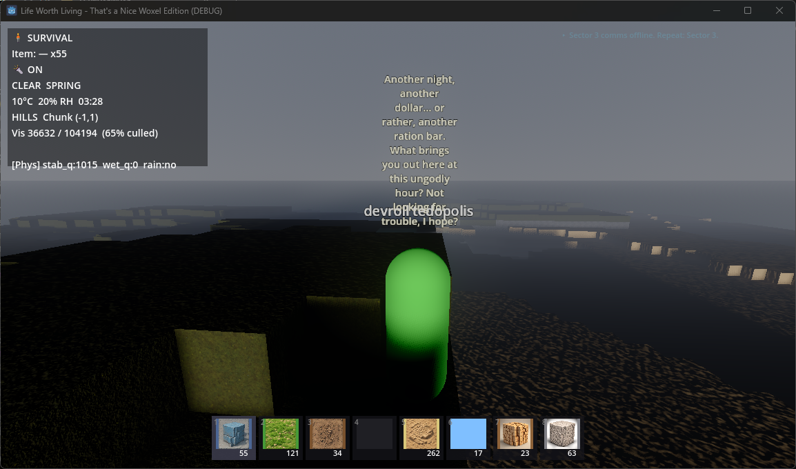

Life Worth Living
A voxel survival‑horror‑comedy powered by local LLMs
(Alpha Build — Seeking Testers, Especially LM Studio Users)

📸 Screenshots

Gameplay Screenshot  

NPC Interaction / Dialogue  

🎮 What Is Life Worth Living?

Life Worth Living is a Godot 4 voxel survival game set in a post‑nanite‑apocalypse world where humanity didn’t quite become zombies… but something much stranger.
The story evolves, the characters grow, and blocks that don't have enough support will fall. Nanite zombies can break parts of your house, and knock down entire
walls. All crafting will be done by nanites using materials collected while exploring. 
Game Saves - World is persistent, similar to Minecraft, but allows for instance saves and replay from any point, similar to Fallout/Elder Scrolls.

It blends:

Minecraft‑style voxel building with pseudo-physics for structural integrity checks

Survival mechanics

Horror elements

Absurdist comedy

Local LLM‑driven NPCs, quests, and world simulation

The game is built to be LLM‑native — meaning the world, story, NPC personalities, and quests are all generated and managed by a local AI model running through LM Studio or Ollama.

If you’ve ever wanted a survival game where the NPCs actually think, remember you, hold grudges, and generate infinite quests… this is that game.

🧠 LLM‑Powered Systems

The following systems are fully implemented (or partially implemented) and ready for testers:

World Manager
Generates world events

Spawns items

Controls weather, nanite anomalies, and environmental storytelling

Story Director
Drives the main narrative

Manages story beats

Ensures that any secrets or surprises in the story are revealed at the correct time

Keeps tone consistent (horror + comedy + heart)

NPC Brain
Every NPC has a generated profile

Personality, mood, inventory, faction, and dialogue topics

NPCs remember what you’ve done

They react to your reputation, actions, and past conversations

NPC Dialogue
Fully LLM‑generated

Context‑aware

Supports short conversations, greetings, and topic‑based responses

Note: LM Studio is currently the only supported way to get story + NPC behavior.
Without it, the game runs — but the world will feel empty. You can still build 
and explore just the same.

🧪 Alpha Status — What Works, What Needs Testing

✔️ Working

World generation (seeded, noise‑based, chunk streaming)
Biomes implemented. Chunking needs adjustment to limit
game halting 0.5-0.9s chunk saves/loads.

Block placement/removal - Added depth adjustment for larger tool sizes and
prefabs with the mouse scroll wheel. Needs minor adjustment for 'feel'.

Doors with hinge physics ( Known placement issue  **actively being patched** )

Light spawning

NPC spawning (friendly + hostile)

Inventory, hotbar, backpack

Block physics (stability + wetness)
  Blocks have a stability. The current system works as such:
  All blocks at world start have stability 0 — "grounded".
  Any block added to the world checks all blocks it is touching.
    It then assigns itself stability = highest sequential empty position
  Essentially, if the blocks it touches are [ 0, 1, 3, 4 ], it becomes a 2.
  If the blocks are [ 0, 1, 2, 3, 4 ], it becomes a 5.
  Any time a block is added/removed/ticks it re-adjusts it's stability, and
  adds the immediate 6 spaces around it to a que to re-check stability.
  Currently items are capped at ~14 stability, at which point they will
  eventually (once processed from the que) fall.

Music system (export bug fixed)
Combat/Non-Combat auto-fade and Low-Health-Indication sound added to standard
music system to ensure smooth transitions.

LM Studio connectivity (profile generation, world manager, story director)

⚠️ Needs Testing

NPC profile data returning correctly to UI

Item spawning via LLM

Story state save/load (Multi-Slot system not fully tested)

NPC greeting/topic caching

Dialogue UI patches (bio panel, mood indicator)

❌ Known Issues

Save system has been converted from single slot to a
full labeled save system. Appears to work. Needs more
testing to confirm.

Remove‑block tool depth control implemented with
mouse scroll. Still difficult to control.

Player damage + NPC combat not fully wired

Falling block destruction visuals not implemented

🧭 Roadmap (Short‑Term)

Priority A — Alpha Blockers
Ensure Save system overhaul is effective.
(multi‑slot, autosave, world cards)

Player/NPC damage + healing

Falling block physics + destruction visuals

Priority B — Water & Biomes
Water block type + flow logic

Lake + ocean biomes

Player oxygen system

Priority C — Creative Tools
Creative panel (Shift+~)

Prefab placement mode (simple pre-fab tool exists, needs testing)
Pre-built houses, both player and developer made, will be injectable
into the game in future versions. This includes injecting them into
embedded underground areas, as well as placement of entire cities in
manageable chunks that can be randomized or hand placed, and then
dynamically placed into the game during runtime.

Remove‑block embed depth fix (Still needs adjustment)

🧩 Requirements

Minimum:

For Story/NPC's/Dynamic World Events (Can still explore and build without this)
  GPU capable of running LM Studio models (recommended 7B–13B)

  LM Studio (preferred) or Ollama - Schema.md will provide a unified structured
  output for LM Studio which will help it to do it's job better.

Windows - [Linux builds may come soon, Mac builds: (Need testers)]

Recommended
16GB+ RAM

GPU with 6GB+ VRAM

LM Studio with a 13B model for best NPC behavior

🛠️ Setup Instructions
1. Download the package

2. Install LM Studio (If using local AI)
Download from: https://lmstudio.ai  
Load a model (7B–13B recommended).
Models with tool use ability tend to perform well on
structured output.

4. Enable Structured Output
The game uses a unified schema for all LLM calls.
Structured Output must be ON. Paste the provided Schema.md
into the JSON Structured Output schema.

6. Launch the Game (It is recommended to always use Console version of game)
Open the Wox.exe or Wox.Console.exe or similarly named file.

7. Configure LLM Settings
In‑game Settings → LLM
Set your LM Studio URL (default: http://localhost:1234/v1/chat/completions)
If you are using Ollama, your port is usually 11434.

You can point this to any local endpoint on your network so that you are able
to run the LLM Game Manager and NPCs on one system, while playing the game on
another if you wish.

🧬 The World at a Glance
A nanite apocalypse fractured civilization.
Four megacorps sold competing nanite systems.
One cut corners.
People didn’t die — their nanites took over.

You start in Eusk Village, mentored by Melon Eusk (Space‑Why’s ex‑CEO).
You have upgraded nanites, basic gear, and a mission:

Find answers. Help people. Survive.

The world is filled with:

Human settlements

Raider camps

Corporate ruins

Underground research labs

Nanite‑touched “zombies”

Strange fly‑related phenomena

A twist you absolutely should not see coming

Several twists you absolutely will see coming, and will still fall for

Tone:
Portal + Fallout New Vegas (Wacky Wasteland) + Saints Row absurdity + survival horror.

🧪 How You Can Help (Alpha Testers Wanted)
We are actively seeking testers who can:

✔️ Run LM Studio

This is the biggest need — the game’s story, NPCs, and quests depend on it.

✔️ Test LLM Integration

NPC profile generation

Dialogue

World Manager events

Story Director pacing

✔️ Report Bugs

Especially:

Missing NPC bios

Missing greetings/topics

Item spawn failures

Story state not saving/loading

Characters 'spawning' but never appearing in game

✔️ Provide Feedback

On:

Tone

Humor

Difficulty

World pacing

NPC behavior

🤝 Contributing

Right now the we are not allowing contributions, but we will take suggestions.
Once the code is in a more finalized state, we will likely begin allowing
contributions. It has not been decided if the final product will be open-source
or not at this point. 
One possible compromise might be to open-source a portion of the code that allows
plugin/addon/DLC type changes for the game. This would keep some of the specific
proprietary functions private, but still allow user contribution and independent
developer interaction to the community.

Areas especially open to help:

UI/UX —Changes Adjustments Suggestions—

LLM prompt engineering
  If you see something, in console, a log, that suggests to you what a particular
  prompt issue might be, feel free to pass that along! There can be *MANY* LLM calls
  in a play-test, and with such a small team (read: 1) it becomes very easy to miss
  a few in review.

Dialogue UI

Prefab tools

Water simulation — Coming Soon

Biome generation — Suggestions or Adjustments

Submit PRs or open issues anytime.

📜 License

License will be chosen as code progresses toward a more stable form

💬 Final Notes

This is an ambitious project:
A fully LLM‑driven survival world with infinite quests, emergent NPCs, and a story that blends humor, horror, and heart.

Physics that aren't 100% accurate, but react similarly to what you would expect.

It’s early — but it’s already weird, funny, and surprisingly alive.

If you want to help shape a new kind of AI‑driven game, you’re in the right place.

A few more screenshots:

